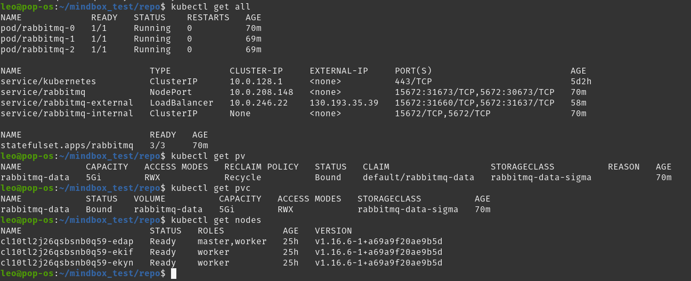
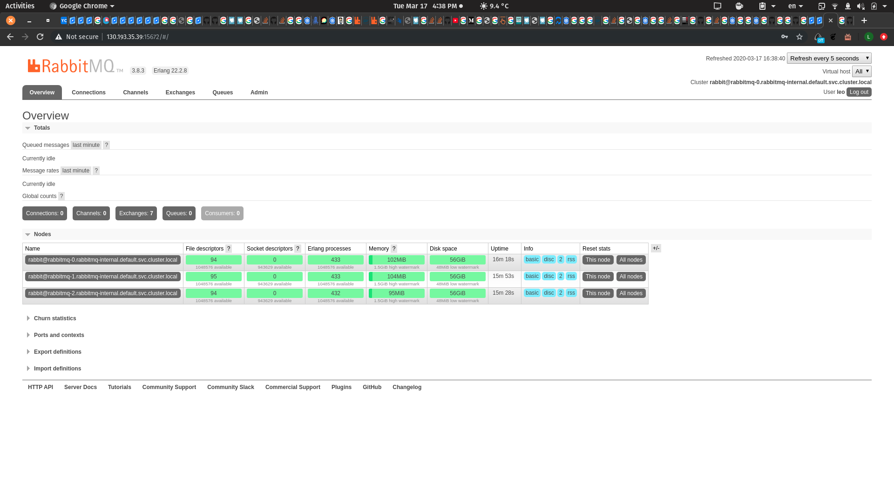

# mindbox_answer

Ответ на тестовое задание mindbox на вакансию junior SRE

disclaimer: 

rmq.yaml - файл деплоя кластера rabbitMQ
publisher.py и consumer.py - приложения на python для тестов (певый создаёт очереди и спамит рандомными строками, второй их читает).

Кластер rabbitmq был развернут на k8s в Яндекс.облаке с помощью persistent volume. До этого опыта ни с одной из технологий не имел.

Кластер доступен по ссылке - http://130.193.35.39:15672/ (пока не закончится тестовый период, креденшелы - в письме)

Использованные статьи и ресурсы:

https://habr.com/ru/company/true_engineering/blog/419817/
https://kubernetes.io/docs/concepts/configuration/assign-pod-node/
https://zupzup.org/k8s-rabbitmq-cluster/
https://kubernetes.io/docs/concepts/workloads/controllers/statefulset/
https://hub.docker.com/_/rabbitmq/
https://kubernetes.io/docs/reference/generated/kubernetes-api/v1.16
https://www.rabbitmq.com/cluster-formation.html#peer-discovery-k8s

Скриншоты:

